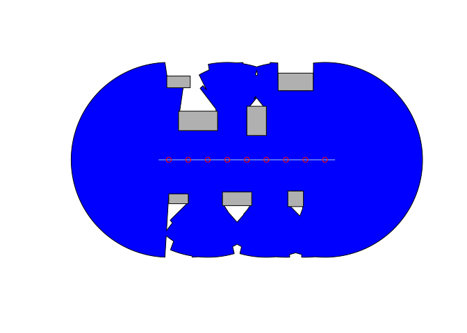

<!-- README.md is generated from README.Rmd. Please edit that file -->

# visor

<!-- badges: start -->

[](https://github.com/CityRiverSpaces/visor/actions/workflows/R-CMD-check.yaml)
<!-- badges: end -->

The goal of visor is to provide a set of tools for visibility analysis.

## Installation

You can install the released version of visor from
[CRAN](https://cran.r-project.org) with:

``` r
install.packages("visor")
```

You can install the development version of visor from
[GitHub](https://github.com/) with:

``` r
# install.packages("pak")
pak::pak("CityRiverSpaces/visor")
```

## Example

This is a basic example which shows you how to solve a common problem:

``` r
library(visor)
library(sf)

occluders_geom <- st_sfc(
  create_occluder(1, 1, 1, 0.5),
  create_occluder(4, 1, 1.5, 0.7),
  create_occluder(7, 1, 0.8, 0.8),
  create_occluder(2, 5, 2, 1),
  create_occluder(5, 5, 1, 1.5),
  create_occluder(1, 7, 1.2, 0.6),
  create_occluder(7, 7, 1.8, 0.9))
occluders <- st_sf(id = 1:7, geometry = occluders_geom)

line_geom <- st_sfc(st_linestring(matrix(c(0, 3, 9, 3), ncol = 2, byrow = TRUE)))
line <- st_sf(id = 1, geometry = line_geom)

vpoints <- get_viewpoints(line, 1)

isovist <- get_isovist(vpoints, occluders, ray_num = 160, ray_length = 5,
                       remove_holes = FALSE)

plot(isovist, col = "blue")
plot(occluders_geom, col = "grey", add = TRUE)
plot(line_geom, col = "lightblue", add = TRUE)
plot(vpoints, col = "red", add = TRUE)
```


